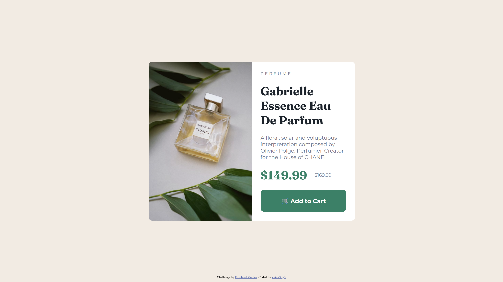

# Frontend Mentor - Product preview card component solution

This is a solution to the [Product preview card component challenge on Frontend Mentor](https://www.frontendmentor.io/challenges/product-preview-card-component-GO7UmttRfa). Frontend Mentor challenges help you improve your coding skills by building realistic projects.

## Table of contents

- [Overview](#overview)
  - [The challenge](#the-challenge)
  - [Screenshot](#screenshot)
  - [Links](#links)
- [My process](#my-process)
  - [Built with](#built-with)
  - [What I learned](#what-i-learned)
  - [Continued development](#continued-development)
  - [Useful resources](#useful-resources)
- [Author](#author)
- [Acknowledgments](#acknowledgments)

## Overview

### The challenge

Users should be able to:

- View the optimal layout depending on their device's screen size
- See hover states for interactive elements
- See the correct mobile/desktop image depending on screen size

### Screenshot



### Links

Solution URL: Add your solution link here

Live Site URL: Add your live site link here

- Solution URL: [https://www.frontendmentor.io/solutions/responsive-product-preview-card-component-using-desktop-first-wDzSi_pw_y](https://www.frontendmentor.io/solutions/responsive-product-preview-card-component-using-desktop-first-wDzSi_pw_y)
- Live Site URL: [https://zvko-3dg3.github.io/product-preview-card-component-main/](https://zvko-3dg3.github.io/product-preview-card-component-main/)

## My process

### Built with

- Semantic HTML5
- CSS3
- Flexbox
- Responsive design (media queries)
- Custom fonts via @font-face
- Desktop-first

### What I learned

This project helped me improve several areas:

- Correct responsive layout

I learned how to switch from a two-column desktop layout to a single-column mobile layout using:

@media (max-width: 800px) {
  main {
    flex-direction: column;
  }
}

- Serving different images depending on screen size

```
By using the <picture> tag:

<picture>
  <source srcset="assets/images/image-product-mobile.jpg" media="(max-width: 800px)">
  
</picture>
```

- Resetting default button styles

Using:

.add-to-cart-button {
  all: unset;
}

### Continued development

In future projects, I want to focus on:

- Improving mobile-first workflow
- Becoming more comfortable with responsive images
- Using CSS Grid for more complex layouts
- Better handling of design tokens (colors, spacing, variables)

### Author

- Frontend Mentor - [@zvko-3dg3](https://www.frontendmentor.io/profile/zvko-3dg3)
- GitHub - [@zvko-3dg3](https://github.com/zvko-3dg3)

### Acknowledgments

Thanks to the Frontend Mentor community for feedback and inspiration.
